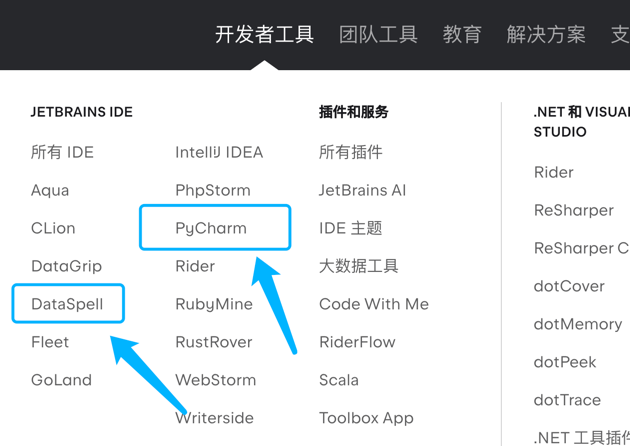

# wecool

Blueberry and his boss help their friends learn deep learning.

老板在学习过程中颇有心得，
于是老板找我谈合作，
并且希望我们学会的一些内容能帮助到有需要的同学

# 1. 我们的问题

1. 你现在想学习深度学习吗
2. 在这个过程中遇到了什么问题吗
3. 如果你想学深度学习有一个更细致的方向吗？图像分类、图像分割 等等
4. 如果没有更细分的方向，那你愿意和我们一起学图像分割吗
5. 如果你有其他的细分方向，你希望从我们这里获得什么呢

深度学习中，主干网络和模块基本都是通用的，学习图像分割肯定也会对其他内容有帮助

如果你都准备好了，那就让我们开始吧！

# 2. 工具

老板前段时间使用学生邮箱激活了 jetbrains 的账号，
激活之后就可以畅游所有的 jetbrains 系列的软件，
正版使用了，贴心的老板已经给了现成的[激活教程](https://www.zhihu.com/tardis/zm/art/560589157?source_id=1005) ~ 
老板还说应该是可以跳过 学籍认证的步骤

激活完成后，就去 [官网](https://www.jetbrains.com.cn/?utm_source=baidu&utm_medium=cpc&utm_campaign=cn-bai-br-brand-ex-pc&utm_content=brand-pure&utm_term=jetbrains)
下载专业版的 PyCharm 和 DataSpell 

# 3. 资源

这个[代码仓](https://github.com/xmu-xiaoma666/External-Attention-pytorch)里面有很多现成的模块和对应的论文，而且有非常精简的示例代码，方便组装自己的模型使用

# 4. 内容

蓝莓和老板总结了如下的学习内容：

| 代码                                                                                                                   | 内容                                   | 视频   |
|----------------------------------------------------------------------------------------------------------------------| -------------------------------------- |------|
|                                                                                                                      | 线性层                                 | 哔哩哔哩 |
| [02-How-to-Update-Weights](https://github.com/teenager-lijh/wecool/tree/master/02-How-to-Update-Weights)             | 梯度下降 && 更新权重                   | 哔哩哔哩 |
| [03-What-is-Activate-Function](https://github.com/teenager-lijh/wecool/tree/master/03-What-is-Activate-Function)     | 什么是激活函数                         | 哔哩哔哩 |
| [04-Dataset-and-DataLoader](https://github.com/teenager-lijh/wecool/tree/master/04-Dataset-and-DataLoader)           | 数据集 && 数据加载器                   | 哔哩哔哩 |
| [05-Normlization-and-Regulation](https://github.com/teenager-lijh/wecool/tree/master/05-Normlization-and-Regulation) | 归一化 && 正则化                       | 哔哩哔哩 |
| [06-Convolution-Neural-Networks](https://github.com/teenager-lijh/wecool/tree/master/06-Convolution-Neural-Networks) | 卷积神经网络                           | 哔哩哔哩 |
| [07-Transposed-CNNs](https://github.com/teenager-lijh/wecool/tree/master/07-Transposed-CNNs)                         | 转置卷积                               | 哔哩哔哩 |
| [08-Image-Segmentation-Model](https://github.com/teenager-lijh/wecool/tree/master/08-Image-Segmentation-Model)       | UNet 图像分割模型                      | 哔哩哔哩 |
| 09-Tricks-of-CNNs                                                                                                    | 一些技巧                               | 哔哩哔哩 |
| 10-Attention-and-Transformer                                                                                         | 注意力机制 && Transformer 模型         | 哔哩哔哩 |
| 11-VisionTransformer-and-TransUNet                                                                                   | 视觉 Transformer (ViT) && TransUNet    | 哔哩哔哩 |
| 12-SwinTransformer-and-SwinUNet                                                                                      | 基于滑动窗口的 Transformer && SwinUNet | 哔哩哔哩 |
| 13-How-to-Build-Your-Own-Modules                                                                                     | 如何做你自己的模块                     | 哔哩哔哩 |

